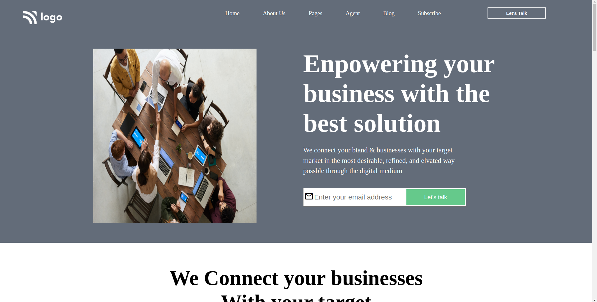
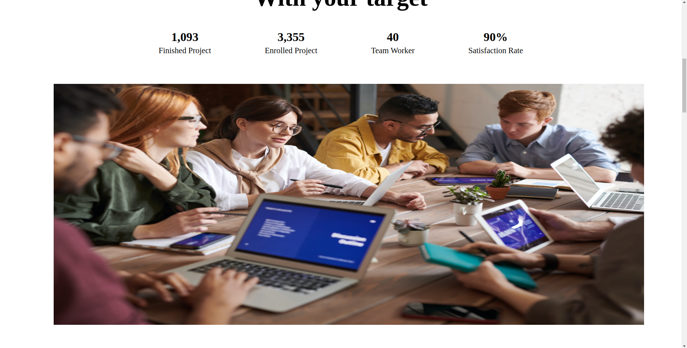
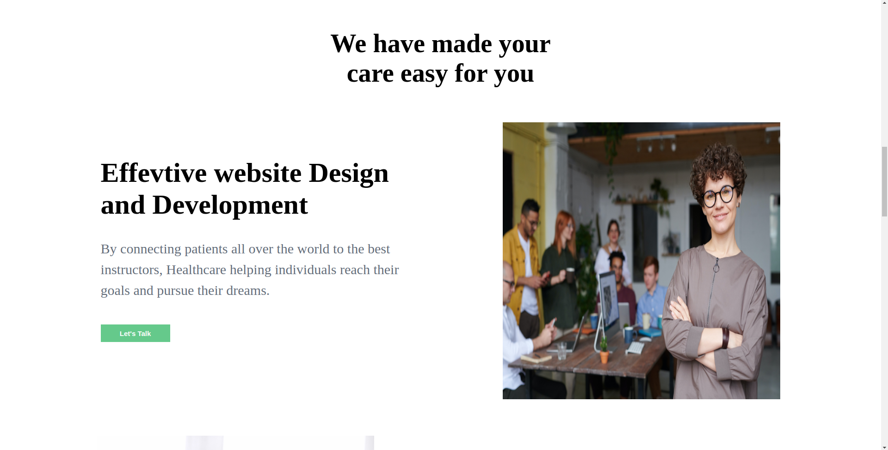
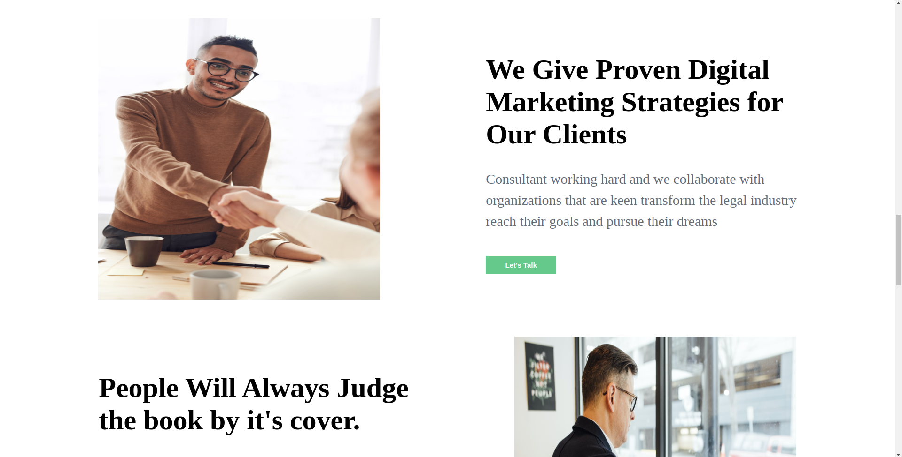
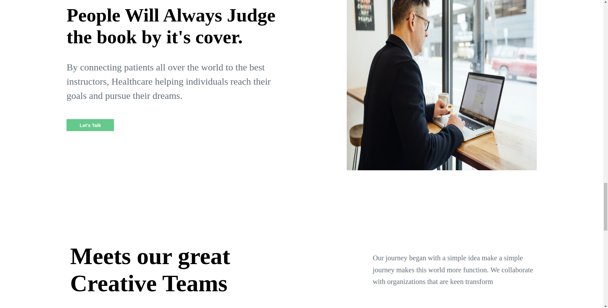
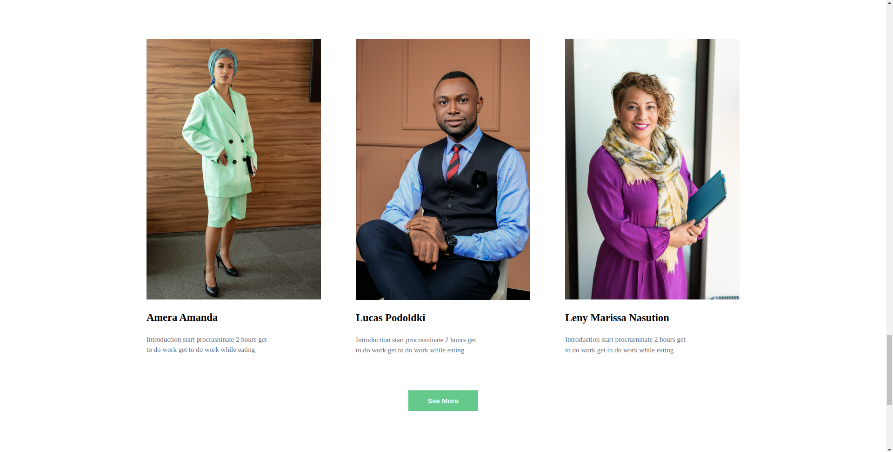
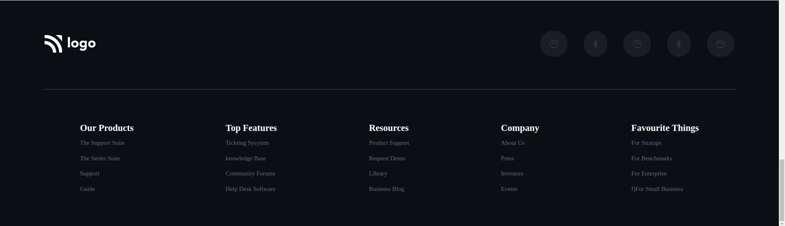

# Business Development | Page - HTML & CSS!

By Prince Kr Paswan

## [Link to the Business Development -Page (project-12)](https://seo-page.netlify.app/)

## What I learned While creating this page?

- Learned to use Image position  property.
- Learned about button placment.
- I learned how to add custom fonts.
- I learned about image positioning and image hight.

## This project took around 6.5 hours to complete.
